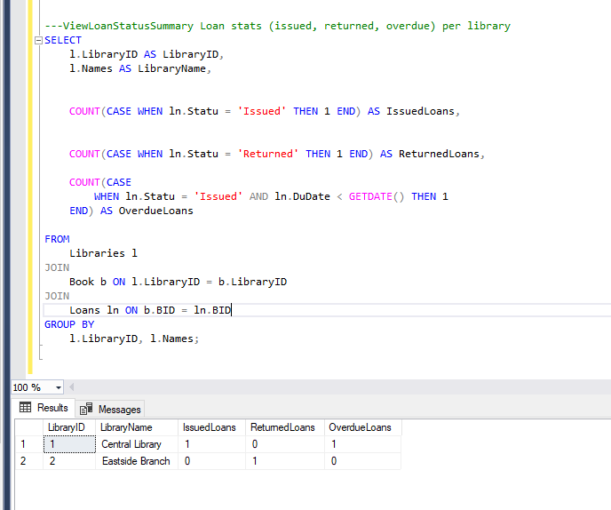
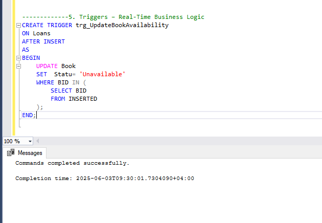

## Repository Name: Library Management System - DB Project Part2 
Goal: Elevate your database from functional to production-ready. In this phase, you’ll improve 
performance, enable advanced reporting, implement automation, and ensure transactional integrity — 
just like a backend engineer in a real-world system.

## 1. SELECT Queries
1- GET /loans/overdue → List all overdue loans with member name, book title, due date

2- GET /books/unavailable → List books not available

3- GET /books/unavailable → List books not available

4- GET /members/top-borrowers → Members who borrowed >2 books

5- GET /books/:id/ratings → Show average rating per book

6- GET /members/inactive → List members with no loans 

7- GET /payments/summary → Total fine paid per member

 

8- GET /reviews → Reviews with member and book info

9- GET /books/popular → List top 3 books by number of times they were loaned

10- GET /members/:id/history → Retrieve full loan history of a specific member including book title, 
loan & return dates

11- GET /books/:id/reviews → Show all reviews for a book with member name and comments

12- GET /libraries/:id/staff → List all staff working in a given library

13- GET /books/price-range?min=5&max=15 → Show books whose prices fall within a given range

14- GET /loans/active → List all currently active loans (not yet returned) with member and book info

15- GET /members/with-fines → List members who have paid any fine

16- GET /books/never-reviewed →  List books that have never been reviewed

17- // GET /members/:id/loan-history →Show a member’s loan history with book titles and loan status.

18- //GET /members/inactive →List all members who have never borrowed any book. 

19- //GET /books/never-loaned → List books that were never loaned.

20- GET /payments →List all payments with member name and book title.

21- //GET /loans/overdue→ List all overdue loans with member and book details.

22- //GET /books/:id/loan-count → Show how many times a book has been loaned.

23- //GET /members/:id/fines → Get total fines paid by a member across all loans. 

24- //GET /libraries/:id/book-stats → Show count of available and unavailable books in a library.

25- 25- //GET /reviews/top-rated → Return books with more than 5 reviews and average rating > 4.5.

## 2. Indexing Strategy – Performance Optimization
Apply indexes to speed up commonly-used queries: 

--------------- Library Table

1. Library Table Non-clustered on Name → Search by name :

2. Non-clustered on Location → Filter by location :

 --------------- Book Table

3. Book Table Clustered on LibraryID, ISBN → Lookup by book in specific library

4. Non-clustered on Genre → Filter by genre 

----------------Loan Table 

5. Non-clustered on MemberID → Loan history

6. Non-clustered on Status → Filter by status

7. Composite index on BookID, LoanDate, ReturnDate → Optimize overdue checks

##  Views – Frontend Integration Support

1. ViewPopularBooks Books with average rating > 4.5 + total loans

2.ViewMemberLoanSummary Member loan count + total fines paid  

3. ViewAvailableBooks Available books grouped by genre, ordered by price

4. ViewLoanStatusSummary Loan stats (issued, returned, overdue) per library

5. ViewPaymentOverview Payment info with member, book, and status

##  3. Functions – Reusable Logic 

1. GetBookAverageRating(BookID) Returns average rating of a book 

2. GetNextAvailableBook(Genre, Title, LibraryID) Fetches the next available book

3. CalculateLibraryOccupancyRate(LibraryID) Returns % of books currently issued 

4. fn_GetMemberLoanCount Return the total number of loans made by a given member.

5. fn_GetLateReturnDays Return the number of late days for a loan (0 if not late).

6. fn_ListAvailableBooksByLibrary Returns a table of available books from a specific library. 

7. fn_GetTopRatedBooks Returns books with average rating ≥ 4.5 

8. fn_FormatMemberName Returns the full name formatted as "LastName, FirstName" 

## 4. Stored Procedures – Backend Automation 

1. sp_MarkBookUnavailable(BookID) Updates availability after issuing

2. sp_UpdateLoanStatus() Checks dates and updates loan statuses

3. sp_RankMembersByFines() Ranks members by total fines paid 

## 5. Triggers – Real-Time Business Logic

1. After new loan → set book to unavailable

2. trg_CalculateLibraryRevenue After new payment → update library revenue 

3. trg_LoanDateValidation Prevents invalid return dates on insert 

## 6. Aggregation Functions – Dashboard Reports 

1. Total fines per member

2. Most active libraries (by loan count)

3. Avg book price per genre 

4. Top 3 most reviewed books 

5. Library revenue report 

6. Member activity summary (loan + fines)

## 7. Advanced Aggregations – Analytical Insight 

1. HAVING for filtering aggregates

2. Subqueries for complex logic (e.g., max price per genre)

3. Occupancy rate calculations 

4. Members with loans but no fine 

5. Genres with high average ratings

## 8. Transactions – Ensuring Consistency 

1. Borrowing a book (loan insert + update availability)

2. Returning a book (update status, return date, availability).

3. Registering a payment (with validation) 

4. Batch loan insert with rollback on failure

