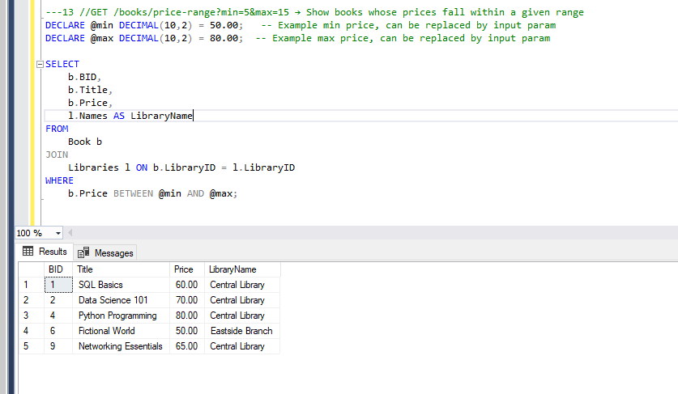

## Repository Name: Library Management System - DB Project Part2 
Goal: Elevate your database from functional to production-ready. In this phase, you’ll improve 
performance, enable advanced reporting, implement automation, and ensure transactional integrity — 
just like a backend engineer in a real-world system.

## SELECT Queries
1- GET /loans/overdue → List all overdue loans with member name, book title, due date

2- GET /books/unavailable → List books not available

3- GET /books/unavailable → List books not available 

4- GET /members/top-borrowers → Members who borrowed >2 books

5- GET /books/:id/ratings → Show average rating per book

6- GET /members/inactive → List members with no loans 

7- GET /payments/summary → Total fine paid per member
 

8- GET /reviews → Reviews with member and book info

9- GET /books/popular → List top 3 books by number of times they were loaned

10- GET /members/:id/history → Retrieve full loan history of a specific member including book title, 
loan & return dates

11- GET /books/:id/reviews → Show all reviews for a book with member name and comments

12- GET /libraries/:id/staff → List all staff working in a given library

13- GET /books/price-range?min=5&max=15 → Show books whose prices fall within a given range

14- GET /loans/active → List all currently active loans (not yet returned) with member and book info

15- GET /members/with-fines → List members who have paid any fine 

16- GET /books/never-reviewed →  List books that have never been reviewed

17- // GET /members/:id/loan-history →Show a member’s loan history with book titles and loan status.

18- //GET /members/inactive →List all members who have never borrowed any book. 

19- //GET /books/never-loaned → List books that were never loaned.

20- GET /payments →List all payments with member name and book title.

21- //GET /loans/overdue→ List all overdue loans with member and book details.

