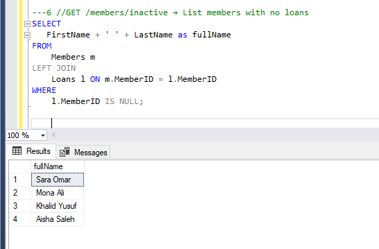

## Repository Name: Library Management System - DB Project Part2 
Goal: Elevate your database from functional to production-ready. In this phase, you’ll improve 
performance, enable advanced reporting, implement automation, and ensure transactional integrity — 
just like a backend engineer in a real-world system.

## SELECT Queries
1- GET /loans/overdue → List all overdue loans with member name, book title, due date

2- GET /books/unavailable → List books not available

3- GET /books/unavailable → List books not available 

4- GET /members/top-borrowers → Members who borrowed >2 books

5- GET /books/:id/ratings → Show average rating per book

6- GET /members/inactive → List members with no loans 

7- GET /payments/summary → Total fine paid per member
 

8- GET /reviews → Reviews with member and book info

9- GET /books/popular → List top 3 books by number of times they were loaned

